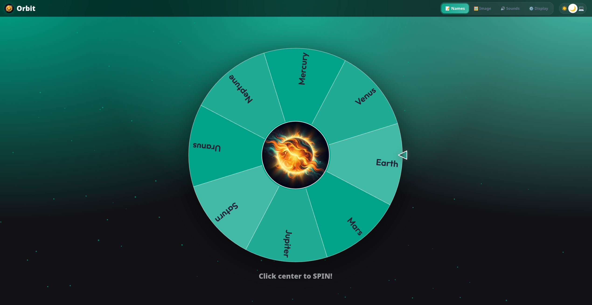

# ☀️ Orbit

**Orbit** is a modern, high-performance, and visually stunning web-based spinner designed for names, raffles, decisions, and random picks. Built with a focus on aesthetics and user experience, it offers a premium feel with glassmorphism effects, smooth animations, and deep customization options.



## ✨ Features

- **📝 Smart Name Management**: Easily add, edit, and remove names from the wheel in real-time.
- **🖼️ Custom Imagery**: Set a central image for your wheel or use it as a full wheel background. Browse a built-in gallery or upload your own.
- **🔊 Immersive Soundscapes**: Dynamic spinning music and winner sound effects (SFX) with full volume control and custom MP3 support.
- **🎨 Premium Design System**:
  - **Glassmorphism UI**: Beautifully blurred, semi-transparent panels.
  - **Dark & Light Modes**: Seamless transition between themes with system auto-detection.
  - **Dynamic Palettes**: Choose from curated color themes that adapt the entire application's look.
- **⚙️ Advanced Customization**: Adjust spin duration, winner messages, and UI scaling to fit any screen or use case.
- **🚀 Performance Focused**: Built with Vite and Tailwind CSS for lightning-fast loads and silky-smooth 60fps animations.

## 🛠️ Tech Stack

- **Frontend**: [Vite](https://vitejs.dev/) + [Tailwind CSS](https://tailwindcss.com/)
- **Logic**: Modern ES6+ JavaScript
- **Infrastructure**: [Docker](https://www.docker.com/) + [Nginx](https://www.nginx.com/)
- **Base Images**: [Chainguard Images](https://www.chainguard.dev/) (for minimal attack surface and maximum security)

## 🚀 Getting Started

### Prerequisites

- [Node.js](https://nodejs.org/) (v22 or higher)
- [npm](https://www.npmjs.com/)

### Development

1. **Clone the repository**:

    ```bash
    git clone https://github.com/guinuxbr/orbit.git
    cd orbit
    ```

2. **Install dependencies**:

    ```bash
    npm install
    ```

3. **Start the development server**:

    ```bash
    npm run dev
    ```

The app will be available at `http://localhost:5173`.

### Production Build

To create an optimized production bundle:

```bash
npm run build
```

The output will be in the `dist/` directory.

## 🐳 Docker Deployment

Orbit comes ready for containerized environments using secure Chainguard images.

### Using Docker Compose (Recommended)

```bash
docker compose up -d
```

### Manual Docker Build

```bash
docker build -t orbit .
docker run -p 8080:80 orbit
```

The application will be accessible at `http://localhost:8080`.

## ⚙️ Configuration

The project uses a standard Vite/Tailwind configuration. You can customize the look and feel by modifying:

- `tailwind.config.js`: Define your color tokens and theme extensions.
- `theme.js`: Manage the dynamic color palettes.
- `nginx.conf`: Fine-tune the production server performance and headers.

## 📜 License

This project is licensed under the MIT License - see the [LICENSE](LICENSE.md) file for details.

---

Built with ☕ by [guinuxbr](https://github.com/guinuxbr).
