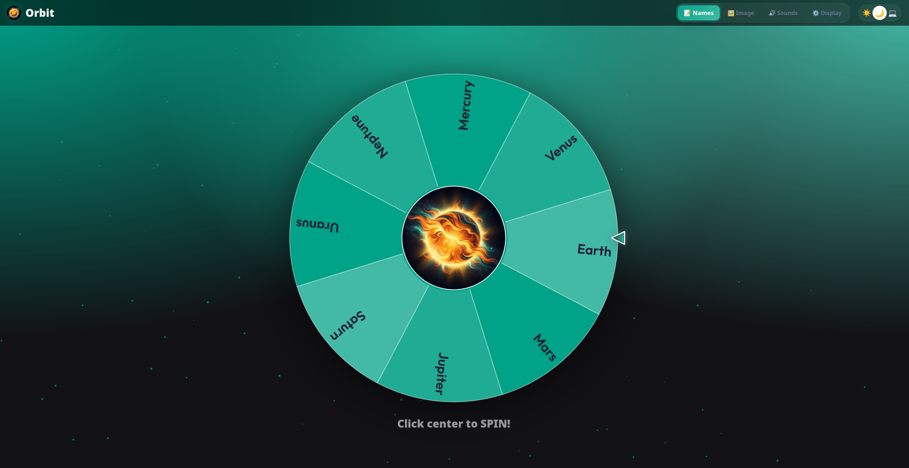

# ☀️ Orbit

**Orbit** is a modern, high-performance, and beautiful web-based spinner designed for names, raffles, decisions, and
random picks. Built with a focus on aesthetics and user experience, it offers a premium feel with glassmorphism effects,
smooth animations, and customization options.

[](https://github.com/guinuxbr/orbit/actions/workflows/deploy.yml)
[](https://github.com/guinuxbr/orbit/actions/workflows/release-and-publish.yml)
[](https://github.com/guinuxbr/orbit/releases/latest)
[](LICENSE.md)
[](https://nodejs.org/)
[](https://github.com/guinuxbr/orbit/pkgs/container/orbit)



## ✨ Features

- **📝 Smart Name Management**: Easily add, edit, and remove names from the wheel in real-time.
- **🖼️ Custom Imagery**: Set a central image for your wheel or use it as a full wheel background. Browse curated
high-resolution photos (via Pexels) or Openverse, with Bring-Your-Own-Key support for self-hosters, or upload your own.
- **🔊 Immersive Soundscapes**: Dynamic spinning music and winner sound effects (SFX) with full volume control and
custom MP3 support.
- **🎨 Premium Design System**:
  - **Glassmorphism UI**: Beautifully blurred, semi-transparent panels.
  - **Dark & Light Modes**: Seamless transition between themes with system auto-detection.
  - **Dynamic Palettes**: Choose from curated colour themes that adapt the entire application's look.
- **⚙️ Advanced Customization**: Adjust spin duration, spin speed (Very Slow → Very Fast), winner messages, and UI
scaling to fit any screen or use case.
- **🚀 Performance Focused**: Built with Vite and Tailwind CSS for lightning-fast loads and silky-smooth,
frame-rate-independent animations.

## 🛠️ Tech Stack

- **Frontend**: [Vite](https://vitejs.dev/) + [Tailwind CSS](https://tailwindcss.com/)
- **Logic**: Modern ES6+ JavaScript
- **Serverless**: [Cloudflare Workers](https://workers.cloudflare.com/) (edge-cached Pexels image proxy with strict
  origin protection)
- **Infrastructure**: [Docker](https://www.docker.com/) + [Nginx](https://www.nginx.com/)
- **Base Images**: [Chainguard Images](https://www.chainguard.dev/) (for minimal attack surface and maximum security)
- **Container Registry**: [GitHub Container Registry (GHCR)](https://ghcr.io) — images published automatically on every
  release

## 🚀 Getting Started

### Prerequisites

- [Node.js](https://nodejs.org/) (v22 or higher)
- [npm](https://www.npmjs.com/)
- [mise](https://mise.jdx.dev/) (recommended — provides task runner and tool version management)

### Development

1. **Clone the repository**:

    ```bash
    git clone https://github.com/guinuxbr/orbit.git && cd orbit
    ```

2. **Install dependencies**:

    ```bash
    npm install
    ```

3. **Start the development server**:

    ```bash
    mise run dev
    # or: npm run dev
    ```

The app will be available at `http://localhost:5173`.

### Available Mise Tasks

| Task                            | Description                                             |
|---------------------------------|---------------------------------------------------------|
| `mise run vite-dev`             | Start the Vite development server (alias: `dev`)        |
| `mise run vite-build`           | Build the production bundle (alias: `build`)            |
| `mise run vite-preview`         | Preview the production build locally (alias: `preview`) |
| `mise run vitest`               | Run the test suite (alias: `test`)                      |
| `mise run rumdl`                | Lint Markdown files with Rumdl                          |
| `mise run rumdl-fmt`            | Format Markdown files with Rumdl                        |
| `mise run wrangler-deploy`      | Deploy the Cloudflare Worker image proxy via Wrangler   |
| `mise run wrangler-tail`        | Stream live logs from the Cloudflare Worker             |
| `mise run release <version>`    | Prepare a release (bump version, test, format & commit) |
| `mise run docker-up`            | Pull the GHCR image and start the container             |
| `mise run docker-down`          | Stop and remove the GHCR container                      |
| `mise run docker-local-build`   | Build the Docker image locally (with version info)      |
| `mise run docker-local-up`      | Build locally and start the container                   |
| `mise run docker-local-down`    | Stop and remove the locally built container             |
| `mise run docker-local-rebuild` | Full rebuild from scratch (no cache)                    |

### Production Build

To create an optimized production bundle:

```bash
mise run build
# or: npm run build
```

The output will be in the `dist/` directory.

## 🐳 Docker Deployment

Orbit ships as a pre-built, secure container image on the GitHub Container Registry.

### Using Docker Compose — GHCR image (Recommended)

Pulls the latest image from GHCR and starts the container:

```bash
mise run docker-up
# or: docker compose up -d
```

The application will be accessible at `http://localhost:28080`.

### Pull and Run Manually

```bash
docker pull ghcr.io/guinuxbr/orbit:latest
docker run -d -p 28080:80 --name orbit ghcr.io/guinuxbr/orbit:latest
```

### Build Locally

The simplest way is via the Mise task, which handles the git metadata arguments automatically:

```bash
mise run docker-local-up
```

Or use Docker Compose directly with explicit `--build-arg` flags:

```bash
docker compose -f docker-compose.local.yml build \
  --build-arg VITE_COMMIT_HASH=$(git rev-parse --short HEAD) \
  --build-arg "VITE_BUILD_DATE=$(git log -1 --format=%ad --date=format:'%d %b %Y')" \
  --build-arg VITE_APP_VERSION=$(node -p "require('./package.json').version")
docker compose -f docker-compose.local.yml up -d
```

### Available Tags

| Tag          | Description                              |
|--------------|------------------------------------------|
| `latest`     | Most recent build from the `main` branch |
| `v1.2.3`     | Specific release version                 |
| `1.2`        | Latest patch of a minor version          |
| `sha-<hash>` | Exact commit build                       |

## ⚙️ Configuration

The project uses a standard Vite/Tailwind configuration. You can customize the look and feel by modifying:

- `tailwind.config.js`: Define your colour tokens and theme extensions.
- `theme.js`: Manage the dynamic colour palettes.
- `nginx.conf`: Fine-tune the production server performance and headers.

## 🔄 CI/CD

| Workflow                   | Trigger        | Description                                                                                                                |
|----------------------------|----------------|----------------------------------------------------------------------------------------------------------------------------|
| **Deploy to GitHub Pages** | Push to `main` | Builds and publishes the app to GitHub Pages                                                                               |
| **Release & Publish**      | Push to `main` | Checks version, builds Docker image, and — if the version is new — creates a GitHub Release and pushes semver tags to GHCR |

Releases are **fully automated**. You can use the helper task to prepare and push a release:

1. Run
   `mise run release --version 1.5.0 --message "Commit message"`
   (bumps versions, runs tests, formats, creates commit `feat(release): release v1.5.0`, and pushes the remote branch).
2. Open and merge a PR into `main`.
3. Merging into `main` automatically creates the `v1.5.0` git tag, the GitHub Release, and the GHCR image.

If you merge a PR without bumping the version, only the `:latest` and `:sha-*` Docker tags are updated — no release is
created.

## 📜 Licence

This project is licensed under the MIT Licence - see the [LICENSE](LICENSE.md) file for details.

---

Built with ☕ by [guinuxbr](https://github.com/guinuxbr).
